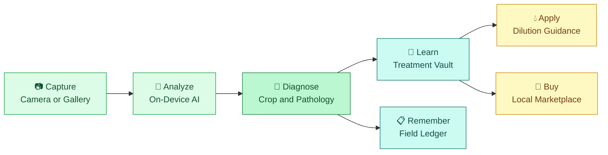

<div align="center">


### 🌿 AI-powered plant disease detection and treatment guidance that works with zero connectivity

<br />


<br />

[**Overview**](#-overview) ·
[**Features**](#-features) ·
[**How It Works**](#-how-it-works) ·
[**Supported Crops**](#-supported-crops) ·
[**Quick Start**](#-quick-start) ·
[**Train Your Model**](#-train-your-own-model) ·
[**Roadmap**](#-roadmap)

</div>

---

## 🌱 Overview

**Dr. Plant AI** is an offline-first agricultural app that identifies plant diseases from a single leaf photo and turns the diagnosis into a clear next step: what it is, how to treat it, how much to spray, and where to buy what you need.

Everything essential runs **on the device**. The neural network, the treatment knowledge and the diagnosis history all live inside the app, so a farmer standing in a field with no signal gets the same experience as someone on fast Wi-Fi.

> 🌾 **Our idea:** move plant-health intelligence out of the cloud and into the farmer's pocket.

---

## ✨ Features

| | Feature | What it does |
|---|---|---|
| 🧠 | **On-device AI diagnosis** | A MobileNetV2-based classifier runs through TensorFlow.js directly in the app. Leaf photos never leave the phone. |
| 📷 | **Smart scanner** | Capture with the camera or pick from the gallery, with built-in image preprocessing. |
| 🌾 | **38-class coverage** | Trained on the full PlantVillage dataset: 14 crops, healthy and diseased leaves. |
| 📖 | **Offline treatment vault** | Organic and chemical protocols, cultural practices and prevention tips stored locally. |
| 🌿 | **Premium organic tier** | Bio-dynamic formulations and schedules for growers who want chemical-free care. |
| 💧 | **Spray guidance** | Practical dosage and dilution advice per knapsack sprayer. |
| 🛒 | **Agri marketplace** | Post-diagnosis product suggestions with local shop discovery, checkout and cash on delivery. |
| 📋 | **Field pathology ledger** | Every diagnosis is stored locally and can be exported as JSON. |
| 🌐 | **Multilingual** | English, Hindi, Marathi, Telugu, Bengali, Swahili and Spanish. |
| 📡 | **Offline status banner** | Clear indication of connectivity so users always know what is available. |

---

## 🔄 How It Works

Dr. Plant AI is more than an image classifier. It connects the diagnosis to the next useful action.



### Inference pipeline

1. The leaf image is resized to **224 × 224** and normalized to match training.
2. The TensorFlow.js model in `public/model/` returns a probability for each of the **38 classes**.
3. The top three predictions are parsed into crop, disease and pathogen type.
4. The matching treatment protocol is loaded from the offline vault.
5. Low-confidence results are flagged so the user can retake the photo.

If the model files are missing, the app falls back to a lightweight heuristic analyzer so the UI still works during development.

---

## 🌾 Supported Crops

The model recognizes **38 classes across 14 crops**.

| Crop | Conditions detected |
|---|---|
| 🍎 **Apple** | Apple scab · Black rot · Cedar apple rust · Healthy |
| 🫐 **Blueberry** | Healthy |
| 🍒 **Cherry** | Powdery mildew · Healthy |
| 🌽 **Corn (Maize)** | Gray leaf spot · Common rust · Northern leaf blight · Healthy |
| 🍇 **Grape** | Black rot · Esca (Black measles) · Leaf blight · Healthy |
| 🍊 **Orange** | Citrus greening (Huanglongbing) |
| 🍑 **Peach** | Bacterial spot · Healthy |
| 🫑 **Bell Pepper** | Bacterial spot · Healthy |
| 🥔 **Potato** | Early blight · Late blight · Healthy |
| 🍓 **Raspberry** | Healthy |
| 🫘 **Soybean** | Healthy |
| 🎃 **Squash** | Powdery mildew |
| 🍓 **Strawberry** | Leaf scorch · Healthy |
| 🍅 **Tomato** | Bacterial spot · Early blight · Late blight · Leaf mold · Septoria leaf spot · Spider mites · Target spot · Yellow leaf curl virus · Mosaic virus · Healthy |

### Treatment knowledge depth

Detection covers all 38 classes. Treatment content is authored in stages:

| Level | Crops | Content |
|---|---|---|
| ✅ **Detailed protocols** | Tomato, Potato, Corn, Apple, Bell Pepper | Disease-specific organic recipes, chemical dosages, cultural and prevention steps |
| 🟡 **General guidance** | All remaining diseases | Broad-spectrum organic and chemical care, shown until a dedicated protocol is added |

The diagnosis itself is always shown accurately from the model output. Only the depth of the treatment write-up differs.

---

## 🏗️ Tech Stack

| Layer | Technology |
|---|---|
| **UI** | React 19, TypeScript, Tailwind CSS 4, Lucide, Motion |
| **Build** | Vite 6 |
| **AI runtime** | TensorFlow.js (in-app, offline) |
| **Model** | MobileNetV2 transfer learning, trained in Keras |
| **Mobile wrapper** | Capacitor 8 (Android) |
| **Local storage** | localStorage and IndexedDB adapter |
| **Payments** | Razorpay checkout (UPI, cards, net banking, COD) |

---

## 📁 Project Structure

```text
Dr_Plant_AI/
├── public/
│   └── model/                      TensorFlow.js model files go here
├── src/
│   ├── components/                 Scanner, results, vault, marketplace, history
│   ├── data/                       Treatment protocols, products, translations
│   ├── lib/
│   │   ├── tflite-pipeline.ts      On-device inference and label parsing
│   │   ├── watermelon-db.ts        Local-first persistence
│   │   └── razorpay.ts             Checkout loader
│   ├── App.tsx                     State machine and navigation
│   └── types.ts                    Shared interfaces
├── capacitor.config.json
├── labels.txt                      Class order used during training
└── train.py                        Model training script
```

---

## 🚀 Quick Start

### Prerequisites

- Node.js 18 or newer
- Android Studio, only if you want to build the Android app

### Run in the browser

```bash
npm install
npm run dev
```

Open `http://localhost:3000`.

### Type-check

```bash
npm run lint
```

### Build for production

```bash
npm run build
```

### Build the Android app

```bash
npm run build
npx cap add android
npx cap sync android
npx cap open android
```

Everything inside `public/` is bundled into the app package, so the model works offline for every user who installs it.

---

## 🧪 Train Your Own Model

The repository expects a TensorFlow.js model in `public/model/`. Here is the full path from dataset to app.

### 1. Get the dataset

Download the **PlantVillage** dataset from Kaggle and use its `color` folder. Each subfolder is one class.

### 2. Train

Set `DATA_DIR` in `train.py` to your dataset folder, then run:

```bash
pip install "numpy<2" tensorflow==2.10.1 matplotlib
python train.py
```

This produces `dr_plant_model.h5` and `labels.txt`.

> 💡 Native Windows GPU training requires TensorFlow 2.10.1 with CUDA 11.2 and cuDNN 8.1. Training also runs on CPU, only slower.

### 3. Convert to TensorFlow.js

Use a separate virtual environment so the converter does not disturb your training setup:

```bash
python -m venv convert_env
convert_env\Scripts\activate
pip install "numpy<2" tensorflow==2.15.0 tf-keras
pip install tensorflowjs --use-deprecated=legacy-resolver
tensorflowjs_converter --input_format=keras dr_plant_model.h5 tfjs_model
```

### 4. Add it to the app

Copy `model.json` and every `group*.bin` file from `tfjs_model/` into `public/model/`.

### 5. Keep the label order in sync

The model outputs probabilities in the same order as `labels.txt`. That order must match `PLANTVILLAGE_CLASSES` in `src/lib/tflite-pipeline.ts`. If you retrain on a different set of classes, update that list to match.

---

## 🗺️ Roadmap

- [x] On-device TensorFlow.js inference
- [x] 38-class PlantVillage coverage
- [x] Offline treatment vault with multilingual content
- [x] Field pathology ledger with JSON export
- [x] Marketplace with checkout and cash on delivery
- [ ] Disease-specific protocols for grape, cherry, squash, strawberry and citrus
- [ ] Optional model update download when online
- [ ] Offline diagnosis queue with sync
- [ ] Confidence-based retake guidance with framing hints
- [ ] Local treatment reminders
- [ ] Voice guidance in regional languages
- [ ] Field-photo fine-tuning to improve accuracy on real-world images

---

## ⚠️ Important Notes

- **Advisory only.** Dr. Plant AI provides general guidance and is not a substitute for a qualified agronomist. Confirm chemical choices and dosages against local regulations and product labels before applying them.
- **Dataset limits.** PlantVillage images are taken on plain backgrounds. Accuracy on cluttered field photos can be lower, so retake photos with a single leaf in good light.
- **Marketplace.** Product and shop suggestions are informational. Availability depends on local partners.

---

<div align="center">

### 🌿 Built for farmers, powered by on-device intelligence

**Diagnose • Understand • Treat • Track**


</div>
