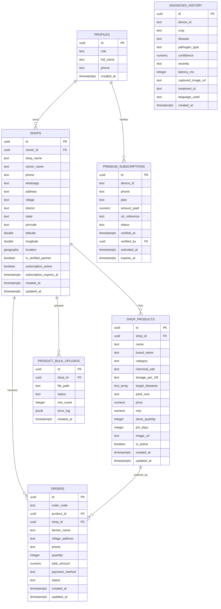

```mermaid
erDiagram
    PROFILES ||--o{ SHOPS : owns
    SHOPS ||--o{ SHOP_PRODUCTS : lists
    SHOPS ||--o{ PRODUCT_BULK_UPLOADS : uploads
    SHOPS ||--o{ ORDERS : receives
    SHOP_PRODUCTS ||--o{ ORDERS : ordered_as
    PROFILES ||--o{ PREMIUM_SUBSCRIPTIONS : verifies

    PROFILES {
        uuid id PK
        text role
        text full_name
        text phone
        timestamptz created_at
    }

    SHOPS {
        uuid id PK
        uuid owner_id FK
        text shop_name
        text owner_name
        text phone
        text whatsapp
        text address
        text village
        text district
        text state
        text pincode
        double latitude
        double longitude
        geography location
        boolean is_verified_partner
        boolean subscription_active
        timestamptz subscription_expires_at
        timestamptz created_at
        timestamptz updated_at
    }

    SHOP_PRODUCTS {
        uuid id PK
        uuid shop_id FK
        text name
        text brand_name
        text category
        text chemical_salt
        text dosage_per_15l
        text_array target_diseases
        text pack_size
        numeric price
        numeric mrp
        integer stock_quantity
        integer phi_days
        text image_url
        boolean is_active
        timestamptz created_at
        timestamptz updated_at
    }

    PRODUCT_BULK_UPLOADS {
        uuid id PK
        uuid shop_id FK
        text file_path
        text status
        integer row_count
        jsonb error_log
        timestamptz created_at
    }

    ORDERS {
        uuid id PK
        text order_code
        uuid product_id FK
        uuid shop_id FK
        text farmer_name
        text village_address
        text phone
        integer quantity
        numeric total_amount
        text payment_method
        text status
        timestamptz created_at
        timestamptz updated_at
    }

    PREMIUM_SUBSCRIPTIONS {
        uuid id PK
        text device_id
        text phone
        text plan
        numeric amount_paid
        text utr_reference
        text status
        timestamptz verified_at
        uuid verified_by FK
        timestamptz activated_at
        timestamptz expires_at
    }

    DIAGNOSIS_HISTORY {
        uuid id PK
        text device_id
        text crop
        text disease
        text pathogen_type
        numeric confidence
        text severity
        integer latency_ms
        text captured_image_url
        text treatment_id
        text language_used
        timestamptz created_at
    }
```
