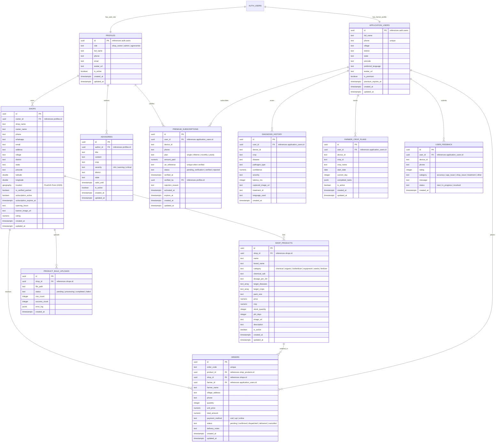

# Dr. Plant AI - Unified Database Architecture & ER Diagram

This database schema serves as the single source of truth for both:
1. **The Mobile / PWA App**: Used by farmers for real-time disease diagnosis, local agro-shop product discovery, ordering, and crop management.
2. **The Web Portals**:
   - **Shop Partner Portal**: For verified agro-input shops to manage store details, product inventory, bulk uploads, and fulfill customer orders.
   - **Admin Web Dashboard**: For platform administrators to approve partner shops, review UPI payments / premium subscriptions, publish crop advisories, and analyze marketplace telemetry.
   - **Agronomist Portal**: For agricultural experts to publish regional advisories and disease management advisories.

---

## Entity Relationship Diagram (ERD)

